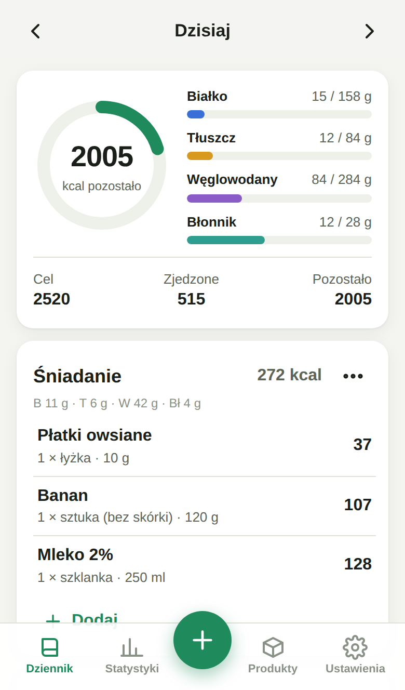
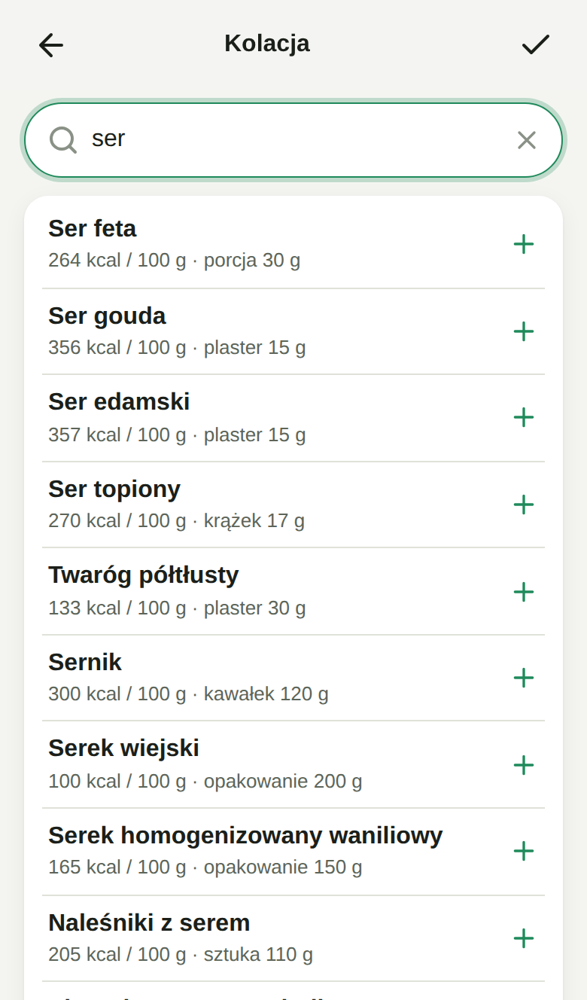
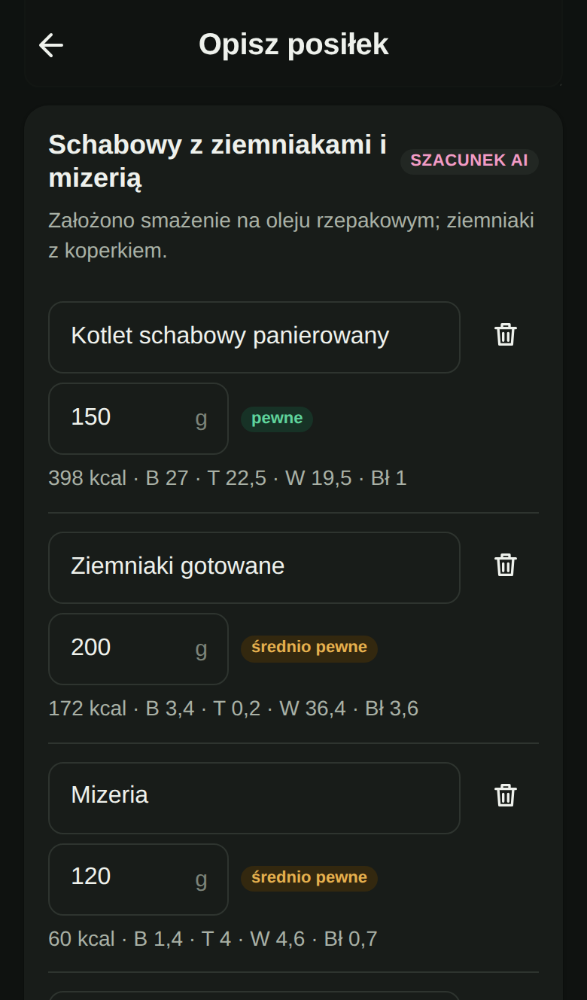
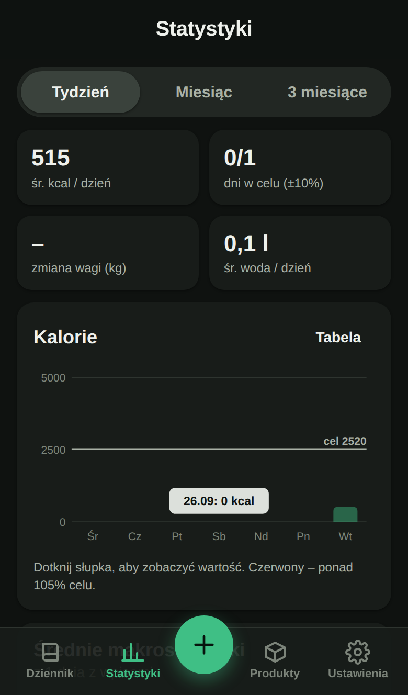

# Kalorie – licznik kalorii (PWA)

Aplikacja do liczenia kalorii i makroskładników, działająca w przeglądarce i instalowana na iPhonie jako aplikacja z ekranu początkowego. Cały interfejs jest po polsku. Dane są przechowywane tylko na Twoim urządzeniu (IndexedDB), bez kont i logowania.

| Dziennik | Wyszukiwanie | Szacowanie AI | Statystyki |
|---|---|---|---|
|  |  |  |  |

## Funkcje

- **Dziennik**: śniadanie, obiad, kolacja, przekąski i własne posiłki. Podsumowanie dnia (kalorie pozostałe do celu, białko, tłuszcz, węglowodany, błonnik), nawigacja po dniach, edycja, usuwanie z opcją „Cofnij”, kopiowanie posiłku albo całego dnia z innej daty, szybkie dodanie samych kalorii.
- **Waga i woda**: pomiary wagi z wykresem, licznik wody (szklanki).
- **Statystyki**: wykres tygodnia, miesiąca i 3 miesięcy, średnie makroskładniki, dni w celu. Każdy wykres ma też widok tabeli.
- **Baza produktów**:
  - wbudowana baza **334 produktów** (owoce, warzywa, mięso, ryby, nabiał, pieczywo, kasze, strączki, słodycze, napoje, typowe polskie dania) z typowymi porcjami. Działa offline;
  - **Open Food Facts**: wyszukiwanie po nazwie (z preferencją produktów sprzedawanych w Polsce) i po kodzie kreskowym;
  - **USDA FoodData Central** jako uzupełnienie dla produktów ogólnych (nazwy angielskie);
  - własne produkty, przepisy z kilku składników, ulubione, ostatnio używane;
  - wyszukiwanie odporne na brak polskich znaków („jablko” znajduje „Jabłko”, „losos” znajduje „Łosoś”).
- **Skaner kodów kreskowych**: aparat telefonu (ZXing dołączony do aplikacji, bo Safari nie ma `BarcodeDetector`) albo ręczne wpisanie kodu. Nieznany produkt dodajesz z etykiety, a przy następnym skanie aplikacja go rozpozna.
- **Szacowanie kalorii ze zdjęcia** (Gemini API przez Twój backend): zdjęcie z aparatu albo z galerii, kompresja do ok. 1024 px, lista składników z gramami, kaloriami, makro i poziomem pewności. Przed zapisaniem możesz wszystko poprawić. Jest też tryb „opisz posiłek słowami”.
- **Cel**: kalkulator zapotrzebowania (wzór Mifflina-St Jeora) z poziomem aktywności i celem (redukcja, utrzymanie, masa). Aplikacja nie ustawi celu poniżej rozsądnego minimum (1200 kcal dla kobiet, 1500 kcal dla mężczyzn) ani deficytu większego niż 25%. Podział makro możesz ustawić sam.
- **Kopia zapasowa**: eksport i import wszystkich danych do pliku JSON.
- **PWA**: działa offline, ma jasny i ciemny motyw, obsługuje „notch” i pasek domowy iPhone'a (safe areas). Pola liczbowe mają 16 px i klawiaturę numeryczną z przecinkiem, więc iOS nie powiększa widoku.

---

## 1. Uruchomienie na GitHub Pages (hosting aplikacji)

Aplikacja jest budowana i publikowana automatycznie przez GitHub Actions (`.github/workflows/deploy.yml`) po każdym wypchnięciu zmian na gałąź `main`.

1. **Gałąź `main`.** Workflow wdrożenia uruchamia się dla gałęzi `main`. Jeśli repozytorium ma tylko gałąź z kodem (np. `claude/...`), możesz:
   - utworzyć Pull Request do `main` i go scalić, **albo**
   - w GitHubie wejść w **Settings → Branches** i zmienić nazwę gałęzi domyślnej na `main` (ikona ołówka przy nazwie gałęzi).
2. Wejdź w **Settings → Pages** i w polu **Source** wybierz **GitHub Actions**.
3. Wejdź w zakładkę **Actions**, wybierz **„Wdrożenie na GitHub Pages”** i kliknij **Run workflow** (albo wypchnij dowolną zmianę na `main`).
4. Po 1–2 minutach aplikacja będzie dostępna pod adresem:
   `https://<twoja-nazwa-użytkownika>.github.io/kalorie-app/`
   Dla tego repozytorium: **https://ofc0urse.github.io/kalorie-app/**

Ścieżkę (`/kalorie-app/`) workflow ustawia automatycznie na podstawie nazwy repozytorium.

---

## 2. Wdrożenie backendu AI (Cloudflare Worker + Gemini API), krok po kroku

Szacowanie ze zdjęcia i z opisu wymaga małego backendu, który trzyma Twój klucz **Gemini API** (Google AI Studio). **Klucz nigdy nie trafia do kodu aplikacji ani do repozytorium.** Jest zapisywany wyłącznie jako *secret* w Cloudflare. Reszta aplikacji działa bez backendu.

Do wdrożenia nie potrzebujesz Maca. Wystarczy komputer z Windows lub Linuxem, albo GitHub Codespaces (terminal w przeglądarce: w repozytorium kliknij **Code → Codespaces → Create codespace**).

### Krok 1: klucz Gemini API

1. Wejdź na **https://aistudio.google.com/apikey** i zaloguj się kontem Google.
2. Kliknij **Create API key** (Utwórz klucz API). Jeśli pojawi się pytanie o projekt, wybierz istniejący albo utwórz nowy.
3. Skopiuj klucz (zaczyna się zwykle od `AIza`). Zachowaj go na chwilę, będzie potrzebny w kroku 4.

Darmowy pakiet w zupełności wystarczy do własnego użytku, ale ma limity liczby zapytań na minutę i na dzień (aktualne wartości: https://ai.google.dev/gemini-api/docs/rate-limits). Gdy limit się wyczerpie, aplikacja pokaże komunikat „Przekroczono limit darmowego pakietu Gemini” z informacją, kiedy spróbować ponownie. Jeśli do projektu w AI Studio podepniesz płatności (np. kredyty), limity rosną – kod nie wymaga zmian.

### Krok 2: konto Cloudflare

Załóż darmowe konto na **https://dash.cloudflare.com/sign-up**. Plan darmowy (Workers Free) w zupełności wystarczy.

### Krok 3: Node.js i pobranie kodu

1. Zainstaluj **Node.js 20 lub nowszy** ze strony **https://nodejs.org** (wersja LTS; w Codespaces jest już zainstalowany).
2. Pobierz repozytorium i przejdź do folderu Workera:
   ```bash
   git clone https://github.com/ofc0urse/kalorie-app.git
   cd kalorie-app/worker
   npm install
   ```

### Krok 4: logowanie, secret i wdrożenie

```bash
# 1) zaloguj wranglera do Cloudflare (otworzy się przeglądarka)
npx wrangler login

# 2) zapisz klucz Gemini jako secret – wklej klucz, gdy wrangler o niego poprosi
npx wrangler secret put GEMINI_API_KEY

# 3) wdróż Workera
npx wrangler deploy
```

Uwagi:
- Wrangler może zapytać o utworzenie Workera przy `secret put`. Odpowiedz **Y (tak)**.
- W Codespaces `wrangler login` może nie otworzyć przeglądarki. Wtedy skopiuj wyświetlony link, otwórz go ręcznie, a po zalogowaniu wklej w terminal adres, na który przekierowała Cię przeglądarka. Możesz też użyć tokenu API: w panelu Cloudflare wybierz **My Profile → API Tokens → Create Token → „Edit Cloudflare Workers”**, a potem ustaw `export CLOUDFLARE_API_TOKEN=...`.

Po wdrożeniu zobaczysz adres Workera, np.:
```
https://kalorie-ai.<twoja-subdomena>.workers.dev
```

Sprawdź, czy działa. Otwórz w przeglądarce `https://kalorie-ai.<twoja-subdomena>.workers.dev/health`. Powinno się pokazać `{"ok":true,"configured":true,...}` z nazwami modeli.

### Krok 5: CORS, czyli dla której strony Worker ma działać

W pliku `worker/wrangler.toml` zmienna `ALLOWED_ORIGINS` zawiera adres strony, która może korzystać z Workera:
```toml
ALLOWED_ORIGINS = "https://ofc0urse.github.io"
```
Jeśli robisz fork, wpisz tu swoją domenę GitHub Pages (tylko `https://nazwa.github.io`, bez `/kalorie-app`) i ponownie uruchom `npx wrangler deploy`. `localhost` jest dozwolony zawsze, żeby dało się testować lokalnie. Żądania z innych stron są odrzucane, zanim dotrą do Gemini – nikt obcy nie zużyje Twojego limitu.

### Krok 6: podłączenie adresu Workera w aplikacji

Wybierz jeden sposób:
- **Najprościej:** w aplikacji otwórz **Ustawienia → Źródła danych i AI → Adres backendu AI** i wklej adres Workera (bez `/estimate` na końcu).
- **Na stałe w buildzie:** w GitHubie otwórz **Settings → Secrets and variables → Actions → zakładka Variables → New repository variable**, jako nazwę wpisz `AI_ENDPOINT`, a jako wartość adres Workera. Potem uruchom ponownie workflow wdrożenia. Adres Workera nie jest tajny, więc może być zmienną, a nie sekretem.

### Modele i ustawienia Workera

Domyślnie aplikacja używa **Gemini 3.5 Flash-Lite** (`gemini-3.5-flash-lite`) – najszybszego i najtańszego modelu z obsługą obrazów. W aplikacji w **Ustawienia → Źródła danych i AI** możesz włączyć **„Dokładniej (Gemini Flash)”** – wtedy Worker używa **Gemini 3.8 Flash** (`gemini-3.8-flash`). Jest dokładniejszy, ale wolniejszy i ma niższy limit w darmowym pakiecie.

Nazwy modeli są w `worker/wrangler.toml`. Gdy Google wyda nowsze wersje, zmień je tam i uruchom `npx wrangler deploy`:
| Zmienna | Domyślnie | Opis |
|---|---|---|
| `MODEL_FAST` | `gemini-3.5-flash-lite` | Model domyślny. |
| `MODEL_ACCURATE` | `gemini-3.8-flash` | Model dla opcji „Dokładniej”. |
| `ALLOWED_ORIGINS` | GitHub Pages | Dozwolone strony (CORS), oddzielone przecinkami. |

Model zwraca wynik przez **structured output** (`responseMimeType: application/json` + `responseSchema`), więc odpowiedź zawsze ma format oczekiwany przez aplikację.

Zabezpieczenia: limit **10 zapytań na minutę na adres IP** (wbudowany limiter Cloudflare, sekcja `[[ratelimits]]`); odrzucanie zdjęć większych niż 1,5 MB, plików niebędących JPEG/PNG/WebP (sprawdzane po zawartości) i opisów dłuższych niż 1000 znaków.

Po zmianie kodu Workera wystarczy ponownie uruchomić `npx wrangler deploy` w folderze `worker`. Logi na żywo pokazuje `npx wrangler tail`.

---

## 3. Instalacja na iPhonie

1. Otwórz adres aplikacji (np. `https://ofc0urse.github.io/kalorie-app/`) w **Safari**.
2. Stuknij **Udostępnij** (kwadrat ze strzałką w górę na dolnym pasku).
3. Przewiń w dół i wybierz **„Do ekranu początkowego”** („Add to Home Screen”), a potem **Dodaj**.
4. Uruchamiaj aplikację ikoną „Kalorie” z ekranu początkowego. Otworzy się na pełnym ekranie, bez paska Safari, i będzie działać offline.

Przy pierwszym skanowaniu kodu albo robieniu zdjęcia iOS zapyta o dostęp do aparatu. Jeśli go odmówisz, możesz go włączyć w **Ustawienia → Aplikacje → Safari → Aparat**. Kod kreskowy zawsze można też wpisać ręcznie.

Aktualizacje instalują się same. Gdy pojawi się nowa wersja, aplikacja pokaże przycisk **„Odśwież”**.

---

## 4. Dane, prywatność i kopie zapasowe

- Dziennik, produkty, przepisy, waga i ustawienia są zapisane **tylko w przeglądarce na tym urządzeniu** (IndexedDB). Nie ma serwera z Twoimi danymi.
- Do zewnętrznych usług trafiają tylko:
  - wyszukiwane frazy i kody kreskowe (do Open Food Facts i USDA);
  - zdjęcia i opisy posiłków (do Twojego Workera, a przez niego do Gemini API). Nie są zapisywane ani w aplikacji, ani w Workerze. Uwaga: w darmowym pakiecie Gemini API Google może wykorzystywać przesłane treści do ulepszania swoich usług – szczegóły w warunkach Gemini API (https://ai.google.dev/gemini-api/terms).
- **Rób kopie zapasowe:** **Ustawienia → Kopia zapasowa → Eksportuj dane (JSON)**. Na iPhonie plik możesz zapisać w aplikacji Pliki lub na iCloud Drive. Import pozwala zastąpić obecne dane kopią albo je połączyć.
- Safari może usunąć dane stron, których długo nie używasz. Aplikacja zainstalowana na ekranie początkowym jest pod tym względem bezpieczniejsza, a regularny eksport zabezpiecza dane w pełni.

### USDA FoodData Central (opcjonalnie)

Bez klucza aplikacja używa `DEMO_KEY`, który ma bardzo mały limit. Darmowy klucz (1000 zapytań na godzinę) dostaniesz na https://fdc.nal.usda.gov/api-key-signup. Wpisz go w **Ustawienia → Źródła danych i AI**. Klucz USDA z założenia nie jest tajny: limit liczy się na klucz, a nie na konto płatnicze.

---

## 5. Rozwój lokalny

Wymagany Node.js 20+.

```bash
npm install
npm run dev          # serwer deweloperski: http://localhost:5173
npm run build        # build produkcyjny do dist/
npm run preview      # podgląd builda: http://localhost:4173
```

Aby testować AI lokalnie, uruchom Workera w drugim terminalu:
```bash
cd worker
cp .dev.vars.example .dev.vars   # wpisz swój klucz Gemini (plik jest w .gitignore)
npm run dev                      # http://localhost:8787
```
Następnie w aplikacji ustaw adres backendu na `http://localhost:8787`.

### Testy

```bash
npm test               # testy logiki (Vitest): kalkulator, wyszukiwanie, mapowanie API, IndexedDB
npm run test:e2e       # testy end-to-end (Playwright) na widoku iPhone'a, z zamockowanymi API
cd worker && npm test  # testy Workera: CORS, walidacja, limity, wywołanie Gemini i błąd 429 (atrapa)
```

Testy e2e nie łączą się z prawdziwymi API: Open Food Facts, USDA i backend AI są zamockowane, a każde inne zapytanie zewnętrzne jest blokowane. Test skanera używa sztucznej kamery Chromium z nagraniem kodu EAN-13, więc ZXing naprawdę dekoduje obraz. Przed pierwszym uruchomieniem testów e2e na własnym komputerze wykonaj `npx playwright install chromium`.

Workflow `Testy` (`.github/workflows/ci.yml`) uruchamia to wszystko przy każdym pushu i Pull Requeście.

### Struktura

```
src/
  api/         klienci: Open Food Facts, USDA, backend AI, limiter zapytań
  data/        wbudowana baza produktów
  db/          IndexedDB (idb)
  lib/         logika: wartości odżywcze, Mifflin-St Jeor, tekst, daty, kody kreskowe, kompresja zdjęć
  ui/          komponenty (arkusze, pola, wykresy SVG, wyniki wyszukiwania)
  views/       ekrany: Dziennik, Dodaj, Skaner, AI, Produkty, Przepis, Statystyki, Ustawienia
  scanner.ts   aparat + BarcodeDetector / ZXing
worker/        Cloudflare Worker (Gemini API)
tests/         unit (Vitest), e2e (Playwright), fixtures
docs/PLAN.md   plan i architektura
```

Stack: Vite, TypeScript, Preact, idb, vite-plugin-pwa (Workbox), @zxing/library; Worker woła REST API Gemini bez dodatkowych bibliotek.

---

## Źródła danych i zastrzeżenia

- Dane produktów z **Open Food Facts** (licencja [ODbL](https://opendatacommons.org/licenses/odbl/1.0/)) tworzy społeczność, więc warto porównać je z etykietą. Brakujące produkty możesz dodać na https://pl.openfoodfacts.org.
- **USDA FoodData Central**: dane publiczne rządu USA.
- Wartości we wbudowanej bazie są uśrednione (tabele składu żywności, USDA, typowe etykiety). Węglowodany są podawane jako **przyswajalne**, czyli bez błonnika, tak jak na etykietach w UE.
- Szacunki AI to przybliżenie, a nie pomiar. Aplikacja nie jest wyrobem medycznym. Przy chorobach, ciąży albo bardzo niskokalorycznej diecie skonsultuj się z lekarzem lub dietetykiem.
